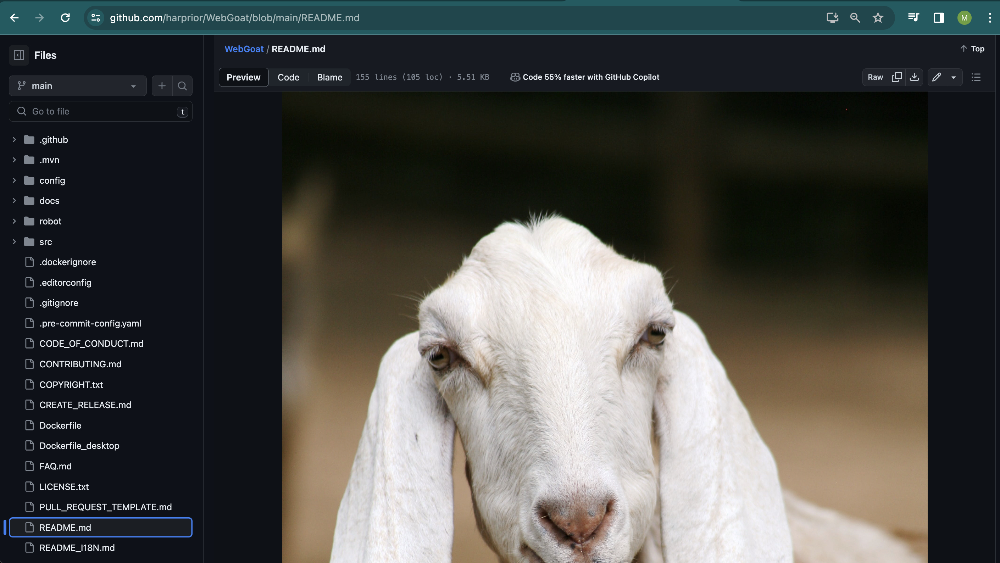

## Steps I followed to run the application

1. Cloned WebGoat repository to my local machine with git clone git@github.com:harprior/WebGoat.git command

2. Installed Docker

3. Pulled WebGoat docker image with docker pull webgoat/webgoat command

3. Installed WebGoat application with docker with run -p 127.0.0.1:8080:8080 -p 127.0.0.1:9090:9090 -e TZ=Europe/Amsterdam webgoat/webgoat

4. Realised that my time zone is not TZ=Europe/Amsterdam and re-started container installation with correct TZ=Asia/Jerusalem timezone ... 

5. Checked that application is running with ~ docker ps

6. Followed to http://8080/WebGoat

7. Success! Attached screenshot: 

8. To change repository settings before committing changes - Go to Settings on Github - Branches - Toggle 'Require a pull request before merging" - - Name Branch name pattern as 'main' - Create rule

## Steps taken to change Webgoat image to the image of my choosing

1. Located README.md file inside WebGoat application

2. Located WebGoat image file and replaced it with the image of my choosing

3. Commited changes

4. Added screenshot: 

